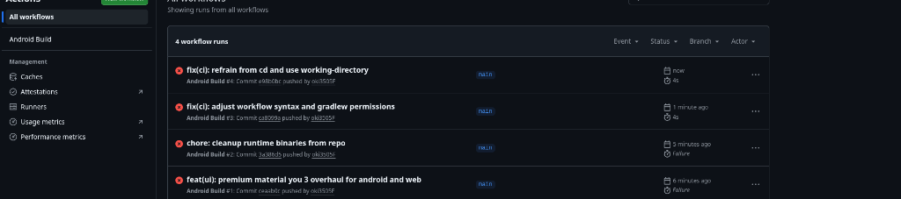

# Noteeeee - Premium Note Taking Experience


**Noteeeee** is a state-of-the-art note-taking application engineered for speed, aesthetics, and fluidity. Built with the latest **Material Design 3 (Material You)** principles, it offers a visually stunning and highly responsive experience across Android and Web platforms.

<p align="center">
  
</p>

## ✨ Features

- **Material You 3 Design**: Fully adaptive, high-contrast dark mode with premium pastel accents (`#D0BCFF` & `#381E72`).
- **Fluid Animations**: Powered by `framer-motion` for buttery smooth transitions and interactions.
- **Glassmorphism**: Modern UI elements with subtle blur effects and depth.
- **Responsive Architecture**: Seamlessly adapts from mobile to desktop layouts.
- **Offline First**: Built with PWA capabilities to work wherever you are.
- **Secure & Fast**: Optimized performance with zero bloat.

## 🛠️ Tech Stack

- **Core**: React 18, TypeScript, Vite
- **UI Framework**: Material UI (MUI) v5
- **Styling**: Emotion, CSS Modules
- **Mobile Runtime**: Capacitor 6 (Android)
- **State Management**: React Hooks (Custom)

## 🚀 Getting Started

### Prerequisites

- Node.js v18+
- JDK 17+ (for Android build)
- Android Studio (optional, for emulation)

### Installation

1. **Clone the repository**
   ```bash
   git clone https://github.com/oki3505F/noteeeee-app.git
   cd noteeeee-app
   ```

2. **Install dependencies**
   ```bash
   npm install
   ```

3. **Run Development Server**
   ```bash
   npm run dev
   ```

### Building for Android

To generate the APK:

```bash
npm run android:build
```

This command acts as a pipeline:
1. Compiles TypeScript and builds the Web assets.
2. Syncs assets to the Capacitor Android project.
3. Invokes Gradle to assemble the Debug APK.

## 📱 Releases

Check the [Releases](https://github.com/oki3505F/noteeeee-app/releases) page for the latest APK downloads.

## 🤝 Contributing

Contributions are welcome! Please feel free to submit a Pull Request.

1. Fork the project
2. Create your feature branch (`git checkout -b feature/AmazingFeature`)
3. Commit your changes (`git commit -m 'Add some AmazingFeature'`)
4. Push to the branch (`git push origin feature/AmazingFeature`)
5. Open a Pull Request

## 📄 License

Distributed under the MIT License. See `LICENSE` for more information.

---

<p align="center">
  Made with ❤️ by <a href="https://github.com/oki3505F">oki3505F</a>
</p>